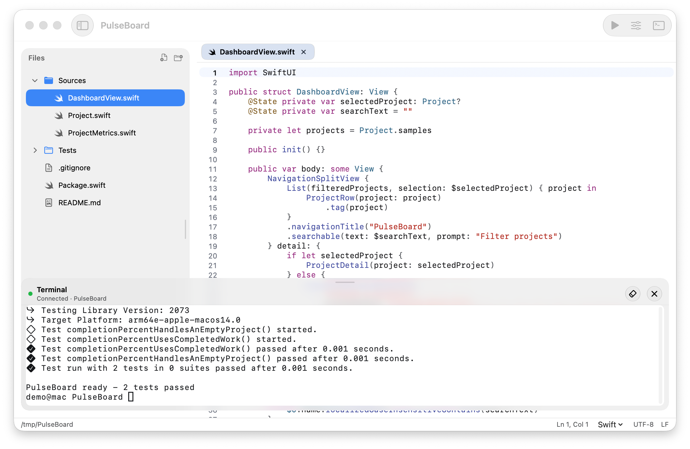
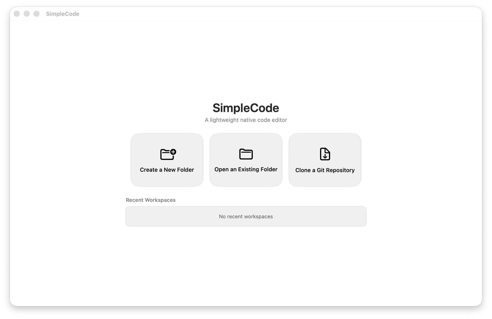

# SimpleCode

SimpleCode is a lightweight native macOS code editor for quick edits—open a workspace, change a few files, run something in the terminal, and move on—without waiting on a heavy IDE or keeping a large project loaded in the background. It focuses on a fast local loop: file tree, tabs, syntax highlighting, find/replace, and an integrated terminal, instead of language servers, debugging, plugins, or remote development.

Start with a new or existing folder—or clone a repository directly—then keep the whole editing loop in one focused native window.

## Tech stack

- **Swift 6** / **SwiftUI** for app chrome, windows, menus, and settings
- **AppKit** (TextKit 2) for the editing surface
- **SwiftTerm** for the integrated terminal
- **tree-sitter** (via SwiftTreeSitter) for syntax highlighting, with grammars for Swift, C/C++, JSON, Markdown, and Bash
- **Apple silicon** / **macOS 26+** only

## Efficiency

SimpleCode stays small on purpose: a thin native UI, viewport-scoped highlighting, and no language server or extension host. Startup and idle cost stay low so it is practical for short editing sessions instead of long-running full-stack workspaces.

## Requirements

- macOS 26 or later
- Apple silicon

## License

MIT. See [LICENSE](LICENSE).
